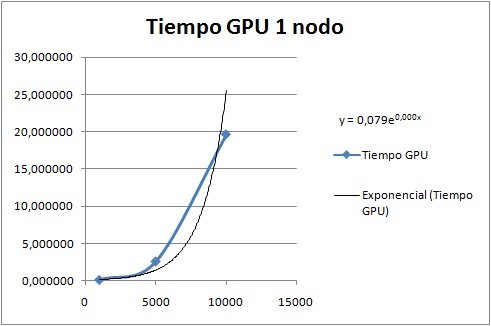
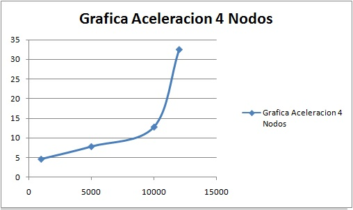

# INFORME SEGUNDO PARCIAL

Para desarrollar este parcial se procedio a divir el problema en dos fases, la primera la lógica de la multiplicacion
de matrices en CUDA, y la segunda la lógica de la multiplicación de matrices con MPI.

Para el programa realizado en CUDA, se reciben los siguientes elementos:

``` cpp
    void multMatCUDA(double *M_a, double *M_b, double *R_c, int NRA, int NCA, int NCB){
                 ...
    }
```
En donde:

1. **M_a:** Es la sub-matriz A.
2. **M_b:** Es la matriz B.
3. **R_c:** Es la matriz C en donde se guardaran los resultados de la multiplicación.
4. **NRA:** Numero de filas de la sub-matriz A.
5. **NCA:** Numero de columnas de la sub-matriz A.
6. **NCB:** Numero de columnas de la matriz B.

Dentro de este se pasan los datos al device, y posteriomente se procede a llamar a la funcion del kernel, la cual ejecuta la multiplicacion de matrices en paralelo con CUDA.

Para el programa realizado en MPI se procede a asignar tareas a los diferentes nodos workers y posteriormente dentro de estos se llama a la función de multiplicacion con MPI o con CUDA,
cuando los resultados han sido generados se procede a enviar de nuevo al master para poder visualizar los resultados.

La funcion de multiplicacion con MPI recibe los siguientes elementos:

``` cpp
void multMatMPI(double *a, double *b, double *c, int NRA, int NCA, int NCB) {
...
}
```

1. **a:** Es la sub-matriz A.
2. **b:** Es la matriz B.
3. **c:** Es la matriz C en donde se guardaran los resultados de la multiplicación.
4. **NRA:** Numero de filas de la sub-matriz A.
5. **NCA:** Numero de columnas de la sub-matriz A.
6. **NCB:** Numero de columnas de la matriz B.

Corremos los dos codigos en CUDA y en MPI, procedemos a generar los .o :
```
    /usr/local/cuda/bin/nvcc matmult.cu -c matmult.o
    mpic++ -c matmult_MPI.cpp -o matmult_MPI.o
```
Despues unimos ambos archivos .o con el siguiente comando:
```
    mpic++ matmult.o matmult_MPI.o -o matmult -L/usr/local/cuda/lib64/ -lcudart
```
Despues procedemos a crear el sbatch de la siguiente manera:
```
#!/bin/bash

#SBATCH --job-name=matmult_MPI
#SBATCH --output=matmult_MPI.out
#SBATCH --nodes=4
#SBATCH --ntasks-per-node=1
#SBATCH --gres=gpu:1

export CUDA_VISIBLE_DEVICES=0
mpirun matmult
```   

Para ejecutar el sbatch escribimos el siguiente comando:

```
sbatch matmult_MPI.sh
```
para visualizar el resultado escribimos el siguiente comando:

```
cat matmult_MPI.out
```

# Analisis de Datos
## Analisis de tiempos en con 1 nodo


| TAMAÑO | TIEMPO GPU (s) | TIEMPO CPU (s) | ACELERACION |
|:------:|:--------------:|:--------------:|:-----------:|
|  1000  |    0,101851    |    1,069300    | 10,49866963x |
|  5000  |    2,575758    |   201,037919   | 78,05000276x |
|  10000 |    19,604473   |  1.874,264806  | 95,60393722x |
|  12000 |        -       |  6.824,166807  |             |
|  15000 |        -       |        -       |             |
|  16000 |        -       |        -       |             |





## Analisis de tiempos en con 2 nodos

| TAMAÑO | TIEMPO GPU (s) | TIEMPO CPU (s) | ACELERACION |
|:------:|:--------------:|:--------------:|:-----------:|
|  1000  |    0,383444    |    0,998909    | 2,605097485x |
|  5000  |    9,363976    |    90,549390   | 9,669972456x xx|
|  10000 |    46,925648   |   863,966832   | 18,41139907x |
|  12000 |    73,820282   |  3.445,512282  | 46,67433107x |
|  13000 |    87,341675   |        -       |             |
|  16000 |        -       |        -       |             |


## Analisis de tiempos en con 3 nodos

| TAMAÑO | TIEMPO GPU (s) | TIEMPO CPU (s) | ACELERACION |
|:------:|:--------------:|:--------------:|:-----------:|
|  1000  |    0,394945    |    1,490261    |  3,77333806xx |
|  5000  |    8,586036    |    85,445632   | 9,951697384xx |
|  10000 |    37,158731   |   632,394241   | 17,01872545xx |
|  12000 |    56,392809   |  2.371,331187  | 42,05024061xx |
|  15000 |    93,067398   |        -       |             |
|  16000 |        -       |        -       |             |


## Analisis de tiempos en con 4 nodos

| TAMAÑO | TIEMPO GPU (s) | TIEMPO CPU (s) | ACELERACION |
|:------:|:--------------:|:--------------:|:-----------:|
|  1000  |    0,450886    |    2,079393    | 4,611793225x |
|  5000  |    10,307496   |    80,476157   | 7,807537058x |
|  10000 |    41,159119   |   525,923289   | 12,77780725x |
|  12000 |    59,228326   |  1.922,168176  | 32,45352867x |
|  15000 |    93,009794   |        -       |             |
|  16000 |   109,081575   |        -       |             |




# Conclusiones

*  El calculo de la multiplicacion de matrices con cuda es mucho mas veloz que el calculo secuencial en CPU, pero la limitacion de memoria de las GPU impide que se puedan lograr calculos mucho mas grandes, esto se podria resolver optimizando el codigo o haciendo uso de tecnicas como las tiles.

* El calculo en CPU permite hacer calculos en matrices con grandes volumenes de datos pero al tener una complejidad exponencial el tiempo de ejecucion fue muy elevado por lo cual no se pudieron tomar mas resultados.

* MPI simboliza un cuello de botella al transferir los datos ya que el envio de mensajes es muy costoso computacionalmente, esto se puede resolver haciendo uso de un mismo sistema de archivos en el momento de la lectura y utilizar mpi a la hora de transmitir los resultados.

* Se nota una aceleracion a la hora de utilizar varios nodos con ambas tecnicas para el calculo de matrices, ya que esto aumenta los recursos de computo, sin embargo observamos que en cuda fue mas rapida la ejecucion con 3 nodos que con 4 nodos.
